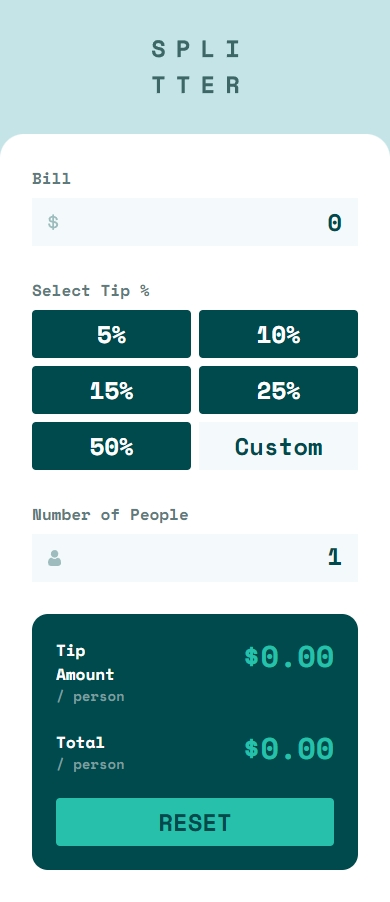
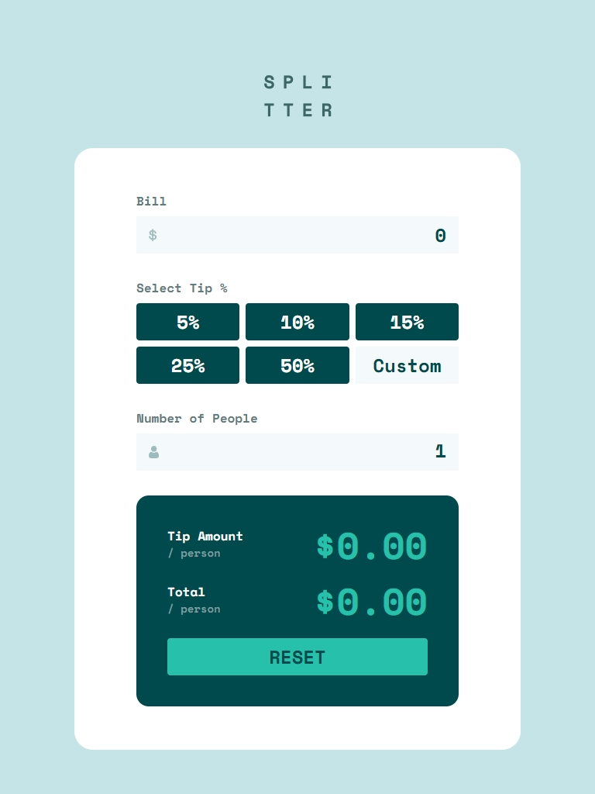
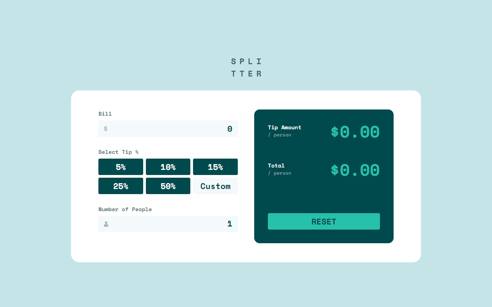

# Time Tracking Dashboard

A responsive calculator for computing tips built with **React**, **Vite**, and **Tailwind CSS**.  
This project is a solution to the [Frontend Mentor Tip Calculator App Challenge](https://www.frontendmentor.io/challenges/tip-calculator-app-ugJNGbJUX).

## LIVE SITE:

[](https://aflamiano-career.github.io/tip-calculator-app/)

---

## Table of contents

- [Overview](#overview)
  - [The Feature](#the-feature)
  - [Screenshots](#screenshots)
- [My process](#my-process)
  - [Built with](#built-with)
- [Acknowledgements](#acknowledgements)

---

## Overview

### The Feature

Users should be able to:

- Calculate the correct tip and total cost of the bill per person
- View the optimal layout for the site depending on their device's screen size
- See hover states for all interactive elements on the page

### Screenshots (Click to view larger)

  

---

## Built with

- Semantic HTML5 markup
- CSS custom properties
- Flexbox and Grid
- Mobile-first workflow
- [React](https://reactjs.org/) - Component-based JS library.
- [Tailwind CSS](https://tailwindcss.com/) - Utility-first CSS framework.
- [Vite](https://vitejs.dev/) - Fast and lean development build tool.
- JavaScript (ES6): Modern JavaScript features and best practices.

#### Sample code

```jsx
 <form>
    <label htmlFor="bill" className="font-bold text-Grey500">
    Bill
    </label>
    {errors.bill && <span>{errors.bill.message}</span>}
    <div className="relative mt-2 mb-8">
        
        <input
        id="bill"
        className="bg-Grey50 text-right px-4 py-2 w-full font-bold text-2xl text-Green900"
        onFocus={(e) => e.target.select()}
        {...register("bill", {
            required: "Please enter a value",
            min: {
                value: 0,
                message: "Must not be negative",
            },
            pattern: {
                value: /^\d+(\.\d*)?$/,
                message: "Must be a valid number",
            },
        })}
        />
    </div>
```

---

## Acknowledgements

- [Frontend Mentor](https://www.frontendmentor.io/) for the challenge and design inspiration.

---
